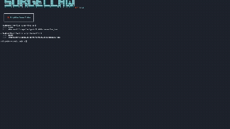

# How to Deploy OpenClaw into Your Business? (SurgeClaw Enterprise) 🦞⚡

**One Machine. Infinite OpenClaws.**  
SurgeClaw is a professional process manager and governance layer for OpenClaw swarms.  
It enables you to deploy, isolate, and audit multiple AI agents on a single machine with zero configuration debt.



---

> **📖 Read our Official Guide:** [How to Deploy OpenClaw for Enterprise & Business](docs/HOW_TO_DEPLOY_OPENCLAW_FOR_ENTERPRISE.md)

## ⚡ Quick Start

### 1. Install
```bash
npm install -g advantage-surgeclaw
```

### 2. Launch
```bash
# Onboard your first agent
surgeclaw onboard

# Activate the swarm
surgeclaw swarm start
```

---

## 🛡️ SurgeClaw Sentinel (v1.1.0)
SurgeClaw Sentinel transforms a group of agents into a **Regulated AI Department**. It layers enterprise-grade security over native OpenClaw logic:

*   **Audit Ledger**: Every management action is recorded to a secure, tamper-proof log for SOC 2 and UAE AI Act compliance.
*   **Strict Mode**: Enforces UNIX 600 (User-Only) permissions at the OS level for agent configuration and memory.
*   **Personal/Enterprise Toggle**: Switch between a low-friction developer mode and a high-governance environment with one choice.

---

## 🏗️ From Monolith to Enterprise Swarm
Running an entire organization on a single OpenClaw instance is a critical vulnerability. In a monolithic setup, shared memory and single-port reliance mean that a fatal error during an experimental script test will bring down your core financial and operational agents. There is no permission boundary, and no audit trail for compliance.

**SurgeClaw** restructures OpenClaw for the Enterprise:
*   **Absolute Failure Isolation**: Every agent lives in a UNIX-locked vault (`chmod 700`). If your "Testing" agent crashes its sandbox, your "CEO" and "Finance" agents remain completely unaffected and online.
*   **Sovereign Compliance**: Out of the box, SurgeClaw Sentinel provides a tamper-proof Audit Ledger, aligning your deployment with **SOC 2, HIPAA, and UAE PDPL** mandates.
*   **Infinite Scalability**: Augment your entire corporate structure. Instantiate a new department entirely isolated from the rest of the company in 10 seconds, leveraging a single piece of hardware with zero network collisions.



---

## 🏛️ Architecture: The "Landlord" Model
SurgeClaw acts as the **Administrative Command Center**. We do not rewrite OpenClaw's "soul"; we orchestrate its environment.


---

## 💼 Use Cases

*   **The Solo Founder**: Run a full C-suite (CEO, CMO, CTO) on a single Mac Mini with absolute data isolation.
*   **The AI Agency**: Deploy isolated, client-specific environments with zero port collisions or credential leaks.
*   **The Enterprise Tower**: Meet regional compliance (UAE PDPL, GDPR) by hosting all AI processing on sovereign local hardware.

---

## 🛠️ Management Commands

| Command | Action |
| :--- | :--- |
| `surgeclaw onboard` | Interactive wizard with Sentinel security choices. |
| `surgeclaw swarm start` | Instant, background deployment of all registered agents. |
| `surgeclaw configure [name]` | Step into an agent's isolated sub-shell (The Office). |
| `surgeclaw status` | Real-time heartbeat and health check for the entire swarm. |

*Full documentation available in* [docs/CLI_REFERENCE.md](docs/CLI_REFERENCE.md).

---

## 📜 Identity & Philosophy
*   **Thin Wrapper**: We inherit every OpenClaw update natively. No maintenance debt.
*   **Identity**: Built for the sovereign developer. Made with 🦞 in Dubai.

**Advantage Technologies Inc. | 2026**
