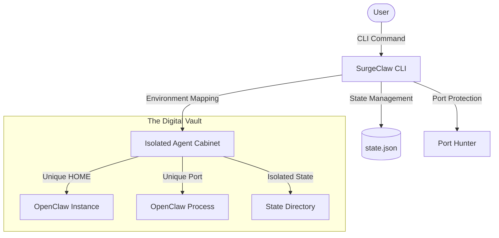
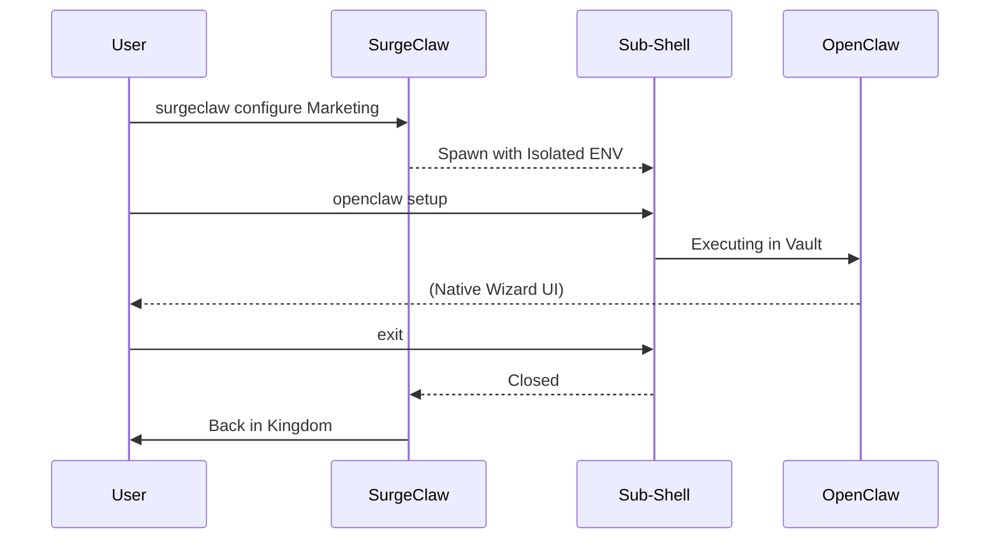

# SurgeClaw Architecture 🦞🏗️

SurgeClaw is designed as a **Thin Orchestration Layer** that magnifies OpenClaw without interfering with its core logic. It uses a "Shadow Environment" pattern to achieve multi-tenancy on a single machine.

## High-Level Workflow

## Key Mechanisms

### 1. Environment Cloaking
SurgeClaw manipulates standard Node.js environment variables to trick OpenClaw into thinking it is running in its own dedicated home directory.
*   `HOME`: Pointed to the agent's unique cabinet.
*   `OPENCLAW_HOME`: Overridden for direct configuration management.
*   `OPENCLAW_STATE_DIR`: Decoupled from the primary OpenClaw instance.

### 2. Smart Port Protection
SurgeClaw identifies the primary OpenClaw port (18789) and reserves it. It then dynamically assigns blocks of 10 ports per agent to prevent background service collisions.

### 3. Sub-shell Interactivity (`configure`)
The `configure` command spawns a child process with an injected environment. This allows users to use native `openclaw` commands directly without SurgeClaw needing to "wrap" every possible function.

## Data Isolation Policy
SurgeClaw follows a STRICT isolation policy. It cannot read or modify the primary `~/.openclaw` configuration unless explicitly authorized during the `onboard` wizard for port detection.
