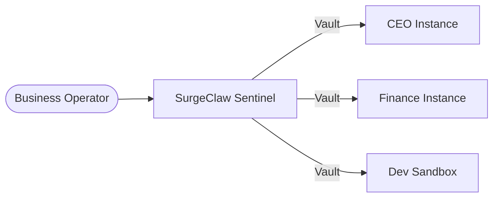

# How to Deploy OpenClaw for Enterprise & Business 🏢

If you are looking to deploy **OpenClaw** for your entire organization, you cannot rely on a single, shared instance. You need a deployment strategy that is:
1. **Scalable**: Capable of running a C-Suite of specialized instances (Finance, Marketing, Dev, HR).
2. **Auditable**: Compliant with enterprise security standards like SOC 2 and GDPR.
3. **Isolated**: Preventing cross-instance data leaks and network collisions.

This guide explains how **SurgeClaw** solves this problem natively.

---

## 🛑 The Problem: The Single Instance Risk
By default, running `openclaw` on a server provides a single instance environment. If you share this instance across departments:
- **Shared Secrets**: Your Testing scripts have the same API keys as your Finance workflows.
- **Single Point of Failure**: A memory leak or fatal loop in one experimental task brings down the entire company's AI capability.
- **Port Collisions**: You cannot reliably run 10 separate `openclaw gateway` commands without deep manual configuration and port tracking.

## ✅ The Solution: SurgeClaw Sentinel
**SurgeClaw** is a wrapper orchestrator designed specifically to bridge the gap between OpenClaw and Enterprise requirements. It uses a **Landlord Governance Model**.



### 1. Absolute Failure Isolation (UNIX Vaults)
When you deploy OpenClaw via SurgeClaw in **Enterprise Mode**, it creates a dedicated, isolated cabinet for every instance.
- It applies **UNIX 700/600 permissions**, locking the instance's memory and configuration to the executing user.
- If the "Dev Sandbox" instance crashes or gets compromised, the "Finance Instance" remains entirely safe and online.

### 2. Built-in Compliance Ledger
Enterprise deployment requires answering the question: *"Who launched this instance, and when?"*
SurgeClaw Sentinel automatically maintains an **Audit Ledger** (`~/.surgeclaw/audit.log`) in JSONL format, providing a tamper-proof trail of all Swarm lifecycle commands (Onboard, Start, Stop, Configure).

### 3. Automatic Resource Management (The 150-Rule)
SurgeClaw dynamically manages network ports. It enforces a strict **150-port spacing buffer** between every OpenClaw instance, ensuring that background Chrome DevTools Protocol (CDP), Relay services, and Canvas websockets never collide.

---

## How to Get Started in 60 Seconds
To deploy OpenClaw for your business, simply install the SurgeClaw Orchestrator over it:

```bash
npm install -g advantage-surgeclaw
```

Then, onboard your first enterprise department:
```bash
surgeclaw onboard
```
*When prompted, select "Enterprise (Regulated)" to activate the Sentinel Vault features.*

👉 **Ready to scale? Read the full [SurgeClaw README](../README.md).**
